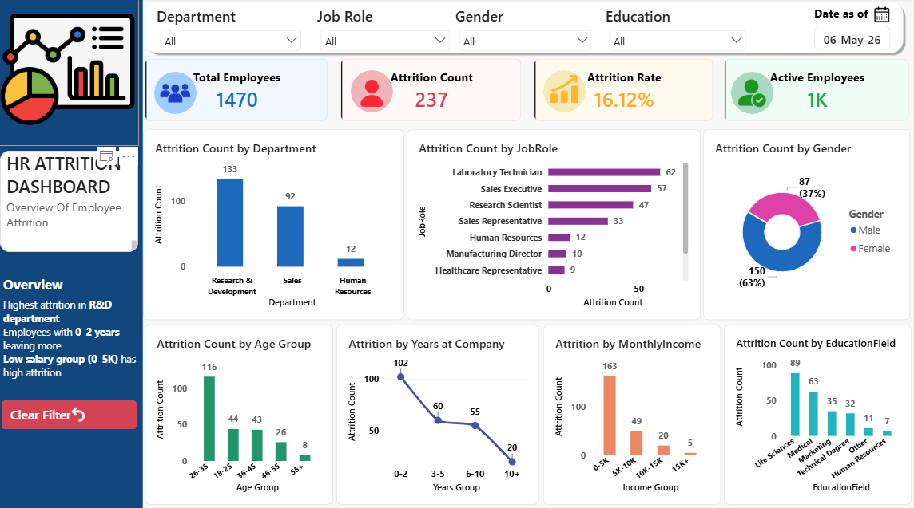

<div align="center">

<!-- HEADER BANNER -->


<!-- BADGES -->
<p align="center">
  
  
  
  
</p>

<br/>

> **📊 An interactive Power BI dashboard analyzing employee attrition patterns across departments, salary bands, age groups, and tenure — helping HR teams make data-driven retention decisions.**

<br/>

</div>

---

## 📌 Table of Contents

- [Overview](#-overview)
- [Dashboard Preview](#-dashboard-preview)
- [Key Insights](#-key-insights)
- [Dataset](#-dataset)
- [Dashboard Features](#-dashboard-features)
- [KPI Metrics](#-kpi-metrics)
- [Charts & Visualizations](#-charts--visualizations)
- [How to Use](#-how-to-use)
- [Tools Used](#-tools-used)
- [Connect with Me](#-connect-with-me)

---

## 🔍 Overview

Employee attrition is one of the most costly challenges for organizations. This Power BI dashboard provides a **360° view of attrition trends** across multiple dimensions — helping HR leaders identify at-risk segments and design targeted retention strategies.

| Metric | Value |
|--------|-------|
| 👥 Total Employees | 1,470 |
| 🚪 Employees Left | 237 |
| 📉 Attrition Rate | **16.12%** |
| ✅ Active Employees | ~1,233 |

---

## 📸 Dashboard Preview

> *(Add your screenshot here)*

```
screenshots/dashboard.png
```

<!-- Replace the line below with your actual screenshot after uploading -->
<!--  -->

---

## 💡 Key Insights

```
┌─────────────────────────────────────────────────────────┐
│                   TOP FINDINGS                          │
├─────────────────────────────────────────────────────────┤
│  🏢  R&D Department       →  Highest attrition (133)   │
│  📅  0–2 Years Tenure     →  Most vulnerable group      │
│  💰  0–5K Salary Band     →  Highest attrition count    │
│  🔬  Research Scientists  →  Top role with exits (47)   │
│  👤  Male Employees       →  63% of total attrition     │
│  🎓  Life Sciences Grads  →  Most attrition by field    │
└─────────────────────────────────────────────────────────┘
```

### 🔑 Business Recommendations
- **Retention bonuses** for employees in 0–2 year tenure bracket
- **Salary revision** for 0–5K income group — significantly underpaid
- **R&D department audit** — investigate workload, growth opportunities
- **Gender-specific engagement** programs for male employees

---

## 📂 Dataset

| Property | Details |
|----------|---------|
| **Source** | [IBM HR Analytics Dataset — Kaggle](https://www.kaggle.com/datasets/pavansubhasht/ibm-hr-analytics-attrition-dataset) |
| **Rows** | 1,470 employee records |
| **Columns** | 35 features |
| **Target Variable** | `Attrition` (Yes / No) |

### Key Columns Used
`Age` · `Attrition` · `Department` · `JobRole` · `Gender` · `MonthlyIncome` · `YearsAtCompany` · `EducationField` · `JobSatisfaction` · `OverTime`

---

## 🎛️ Dashboard Features

- ✅ **Dynamic Filters** — Department, Job Role, Gender, Education
- ✅ **Date Slicer** — Filter data as of a specific date
- ✅ **Clear Filter Button** — Reset all slicers instantly
- ✅ **KPI Cards** — Real-time summary tiles
- ✅ **Cross-chart Filtering** — Click any chart to filter the entire report
- ✅ **Sidebar Insights Panel** — Auto-generated key findings

---

## 📊 KPI Metrics

<div align="center">

| 💼 Total Employees | 🚨 Attrition Count | 📉 Attrition Rate | 🟢 Active Employees |
|:------------------:|:------------------:|:-----------------:|:-------------------:|
| **1,470** | **237** | **16.12%** | **~1,233** |

</div>

---

## 📈 Charts & Visualizations

| # | Chart | Type | Key Finding |
|---|-------|------|-------------|
| 1 | Attrition by Department | Bar Chart | R&D leads with 133 exits |
| 2 | Attrition by Job Role | Horizontal Bar | Research Scientists: 47 |
| 3 | Attrition by Gender | Donut Chart | Male 63% vs Female 37% |
| 4 | Attrition by Age Group | Bar Chart | 26–35 age group: 116 exits |
| 5 | Attrition by Years at Company | Line Chart | Sharp drop after 2 years |
| 6 | Attrition by Monthly Income | Bar Chart | 0–5K band most affected |
| 7 | Attrition by Education Field | Bar Chart | Life Sciences: 89 exits |

---

## 🚀 How to Use

### Prerequisites
- [Power BI Desktop](https://powerbi.microsoft.com/downloads/) (Free)

### Steps

```bash
# 1. Clone this repository
git clone https://github.com/YOUR_USERNAME/hr-attrition-dashboard.git

# 2. Open the Power BI file
cd hr-attrition-dashboard
# Double-click HR_Attrition.pbix OR open via Power BI Desktop
```

**Inside Power BI:**
1. Open `HR_Attrition.pbix`
2. Use the **top filter bar** to slice by Department / Role / Gender / Education
3. Click any chart bar to cross-filter the entire dashboard
4. Click **"Clear Filter"** button to reset all slicers

---

## 🛠️ Tools Used

<p align="left">
  
  
  
  
</p>

---

## 📁 Repository Structure

```
📦 hr-attrition-dashboard/
├── 📊 HR_Attrition.pbix          # Power BI Dashboard File
├── 📄 README.md                   # Project Documentation
├── 📁 dataset/
│   └── 📋 HR_Attrition.csv        # Raw Dataset (1470 rows)
└── 📁 screenshots/
    └── 🖼️ dashboard.png           # Dashboard Preview Image
```

---

## 🤝 Connect with Me

<p align="left">
  <a href="https://linkedin.com/in/YOUR_PROFILE">
    
  </a>
  <a href="https://github.com/YOUR_USERNAME">
    
  </a>
  <a href="mailto:YOUR_EMAIL">
    
  </a>
</p>

---

<div align="center">

⭐ **Agar yeh project helpful laga toh star zaroor karo!** ⭐


</div>
